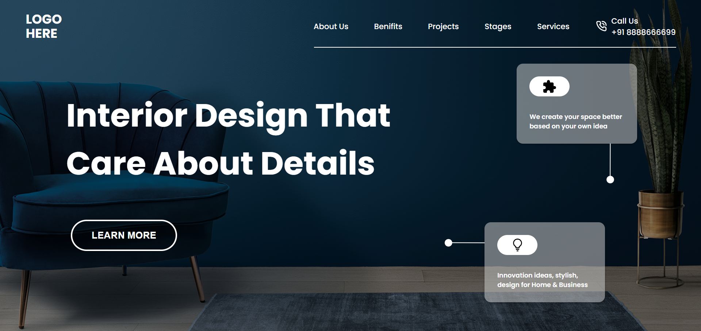

# Project 10 - HTML  and CSS 

By Shubham

Here's the Live Deployed Website 

## [DEPLOYED WEBSITE LINK](https://interiordesignspage.netlify.app/)

## What I learned from this Project?

- I learned about **Layout** making through **Flexbox**.
- I also learned how to use **Icons**.
- I also learned **Offset Some Images**.
- I also learned about **Box Shadow**.
- I also learned how to use **Hover Effect**.
- I also learned about how to make **Glossy Cards**

## This project took around **4 hours** to complete.
